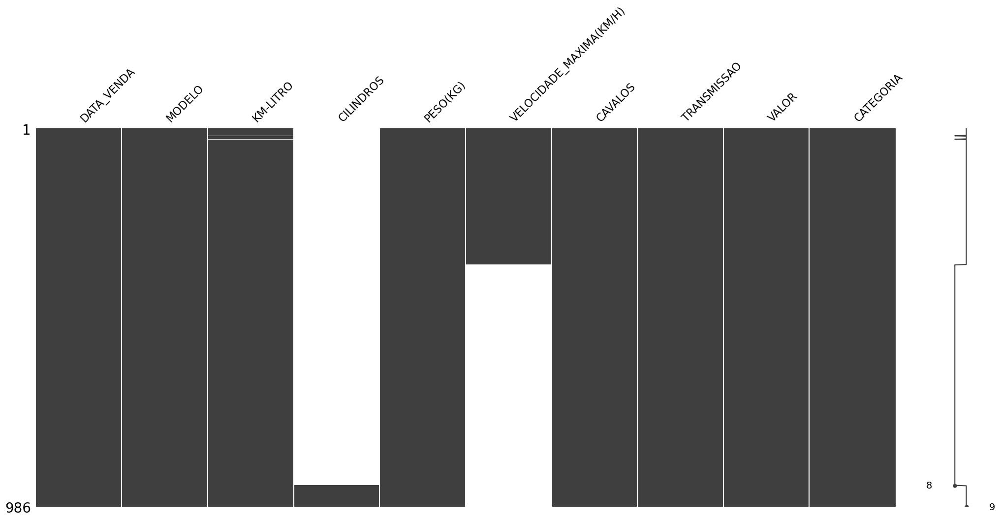
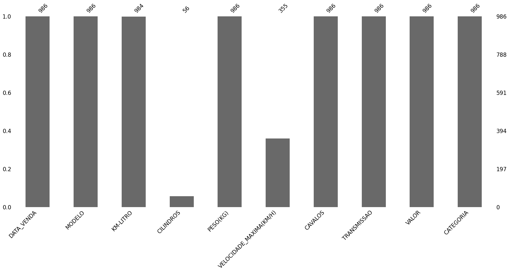

Identificar valores NULOS


```python
# Importando o Pandas e carregando os dados
import pandas as pd
df = pd.read_csv("dados.csv", delimiter = ';' )
df.head()
```


<div>

<table border="1" class="dataframe">
  <thead>
    <tr style="text-align: right;">
      <th></th>
      <th>DATA_VENDA</th>
      <th>MODELO</th>
      <th>KM-LITRO</th>
      <th>CILINDROS</th>
      <th>PESO(KG)</th>
      <th>VELOCIDADE_MAXIMA(KM/H)</th>
      <th>CAVALOS</th>
      <th>TRANSMISSAO</th>
      <th>VALOR</th>
      <th>CATEGORIA</th>
    </tr>
  </thead>
  <tbody>
    <tr>
      <th>0</th>
      <td>10/1/2020</td>
      <td>LABORGUINI</td>
      <td>3.0</td>
      <td>NaN</td>
      <td>1200</td>
      <td>360.0</td>
      <td>700</td>
      <td>AUTOMATICO</td>
      <td>50000000</td>
      <td>IMPORTADO</td>
    </tr>
    <tr>
      <th>1</th>
      <td>10/1/2020</td>
      <td>LABORGUINI</td>
      <td>3.0</td>
      <td>NaN</td>
      <td>1200</td>
      <td>360.0</td>
      <td>700</td>
      <td>AUTOMATICO</td>
      <td>50000000</td>
      <td>IMPORTADO</td>
    </tr>
    <tr>
      <th>2</th>
      <td>10/1/2020</td>
      <td>LABORGUINI</td>
      <td>3.0</td>
      <td>NaN</td>
      <td>1200</td>
      <td>360.0</td>
      <td>700</td>
      <td>AUTOMATICO</td>
      <td>900000</td>
      <td>IMPORTADO</td>
    </tr>
    <tr>
      <th>3</th>
      <td>10/1/2020</td>
      <td>FERRARI</td>
      <td>3.0</td>
      <td>NaN</td>
      <td>1400</td>
      <td>360.0</td>
      <td>640</td>
      <td>AUTOMATICO</td>
      <td>900000</td>
      <td>IMPORTADO</td>
    </tr>
    <tr>
      <th>4</th>
      <td>10/1/2020</td>
      <td>ASTON MARTIN</td>
      <td>3.5</td>
      <td>NaN</td>
      <td>1600</td>
      <td>360.0</td>
      <td>620</td>
      <td>AUTOMATICO</td>
      <td>900000</td>
      <td>IMPORTADO</td>
    </tr>
  </tbody>
</table>
</div>


```python
# Visualizando informações básicas do DataFrame
df.info()
```

    <class 'pandas.core.frame.DataFrame'>
    RangeIndex: 986 entries, 0 to 985
    Data columns (total 10 columns):
     #   Column                   Non-Null Count  Dtype  
    ---  ------                   --------------  -----  
     0   DATA_VENDA               986 non-null    object 
     1   MODELO                   986 non-null    object 
     2   KM-LITRO                 984 non-null    float64
     3   CILINDROS                56 non-null     float64
     4   PESO(KG)                 986 non-null    int64  
     5   VELOCIDADE_MAXIMA(KM/H)  355 non-null    float64
     6   CAVALOS                  986 non-null    int64  
     7   TRANSMISSAO              986 non-null    object 
     8   VALOR                    986 non-null    object 
     9   CATEGORIA                986 non-null    object 
    dtypes: float64(3), int64(2), object(5)
    memory usage: 77.2+ KB


```python
# Contando valores nulos
print(df.isna().sum())
```

    DATA_VENDA                   0
    MODELO                       0
    KM-LITRO                     2
    CILINDROS                  930
    PESO(KG)                     0
    VELOCIDADE_MAXIMA(KM/H)    631
    CAVALOS                      0
    TRANSMISSAO                  0
    VALOR                        0
    CATEGORIA                    0
    dtype: int64


```python
# Caso não tenha instalado esse pacote basta digitar o comando abaixo
# !pip install missingno
```


```python
# Importando o pacote MissingNO
import missingno as msno
```


```python
# Visualizando os valores nulos em formato de matriz
msno.matrix(df)
```


    <Axes: >


    

    


```python
# Visualizando os valores nulos em gráfico de barras
msno.bar(df)
```


    <Axes: >


    

    

